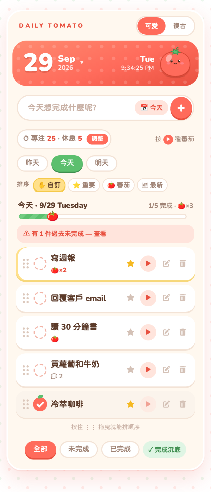
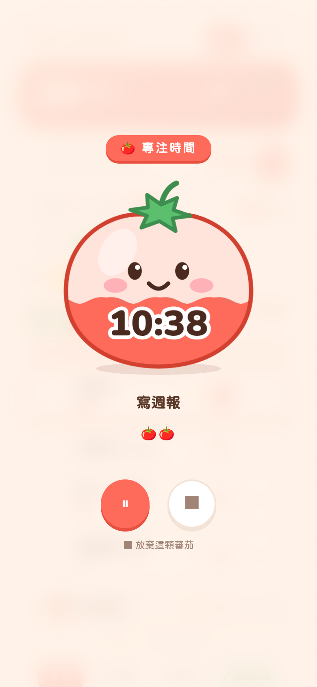
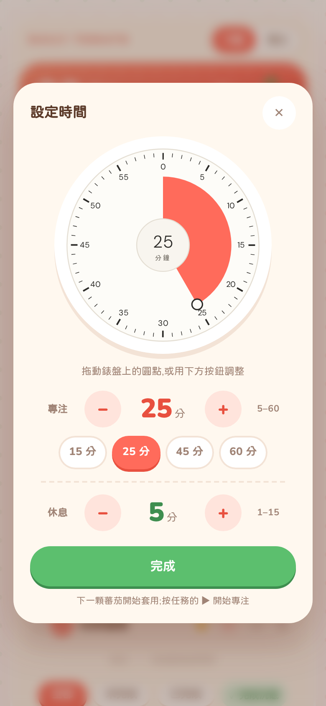
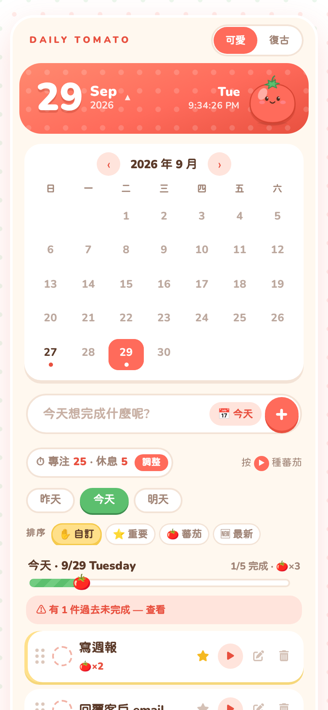
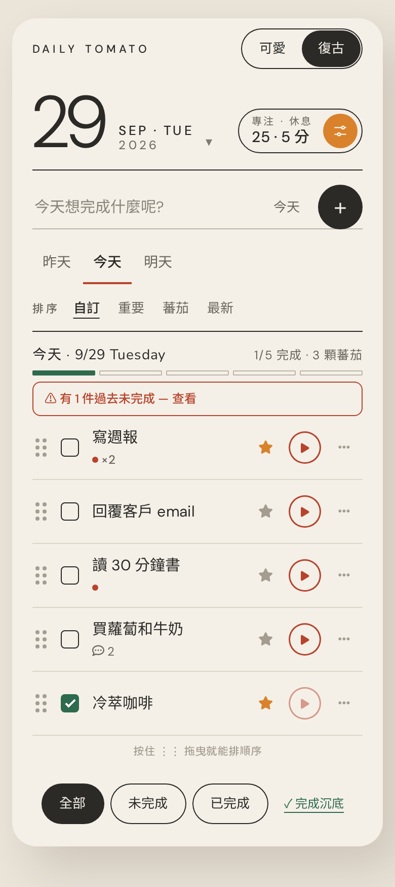
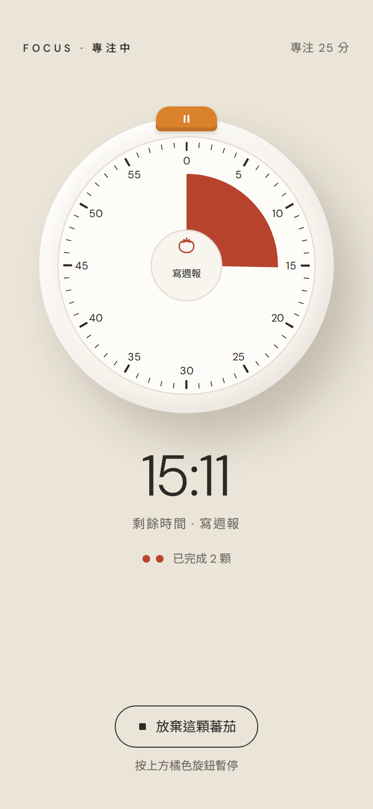
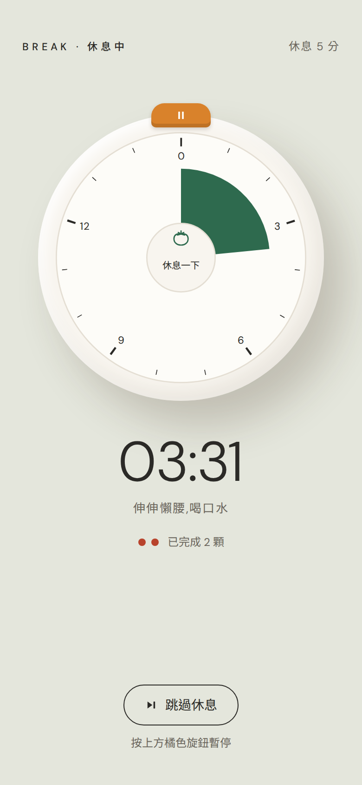

# 🍅 Daily Tomato Todo

[](https://github.com/shueny/vue-daily-tomato-todo/actions/workflows/ci.yml)

以「日」為單位的待辦清單 × 蕃茄鐘。一天一張卡片,左右滑動安排每日任務;選定一件事按下 ▶,整個畫面只剩倒數計時,專心把它做完。有兩種介面主題可以切換:**可愛蕃茄**和**復古計時器**。

- **線上 Demo** → https://shueny.github.io/vue-daily-tomato-todo/
- **設計概念(互動 mockup 與功能決策)** → [docs/design-concept.html](docs/design-concept.html)

### 🍅 可愛主題

<p>
  
  
  
  
</p>

### ⏲ 復古主題

<p>
  
  
  
</p>

## 功能

### 📆 每日卡片
- 一天一張卡,**左右滑動**切換日子(CSS scroll-snap,原生慣性手感)
- 「昨天|今天|明天」膠囊快速切換,離開今天時出現「回今天 ↩」
- 每天有**進度條**與統計(完成數、蕃茄數)
- 任務可新增備註、標星號,以 全部 / 未完成 / 已完成 篩選當日清單

### ↕️ 整理今天要做的事
- 按住任務左邊的 ⋮⋮ **拖曳排序**(滑鼠與觸控都可以);鍵盤選到 ⋮⋮ 後按 ↑ ↓ 也能移動
- 四種排序:**自訂**(拖曳的順序)、**重要**(星號優先)、**蕃茄**(蕃茄多的優先)、**最新**
- **完成沉底**:勾選完成的任務自動沉到最下面(可關閉)
- 排序方式與順序都會記住,重新整理後不變

### 🗓 行事曆
- 點標題的大日期展開整月,**每一天都可點選跳轉**,‹ › 切換月份
- 每日狀態小圓點:灰=有任務、紅=有未完成、綠=全部完成

### ➕ 建立任務時選日期
- 輸入框旁的日期 chip **預設跟著目前檢視的日子** —— 滑到明天的卡片打字,任務就建在明天
- 點 chip 可快選今天/明天/下週,或用日期選擇器挑任意一天
- 編輯視窗也有「今天/明天/下週」按鈕,一鍵把任務移到別天

### ⏰ 逾期處理
- 過去未完成的任務標紅「逾期」,可勾選完成、一鍵「移到今天 →」,或在編輯視窗改到任何一天
- 今天的卡片會提示「⚠ 有 N 件過去未完成」,點擊直接跳去處理

### 🍅 蕃茄鐘
- 按任務的 ▶ 進入**全畫面專注模式**
  - **可愛主題**:一顆會眨眼的大蕃茄,裡面的果汁隨剩餘時間下降;最後一分鐘會冒汗,完成時歡呼 +1 🍅,休息時變成睡著的綠蕃茄
  - **復古主題**:米白圓形機身,0–60 分鐘錶盤上的紅色扇形就是剩餘時間;頂端的橘色旋鈕暫停/繼續,休息時換成 0–15 分鐘的墨綠錶盤
- **自訂時間**:專注 5–60 分、休息 1–15 分。在「設定時間」面板拖動錶盤圓點、用 ± 或方向鍵調整,也有 15/25/45/60 常用長度
- 專注結束自動進入休息;每完成一輪專注,該任務累積一顆 🍅
- 倒數以結束時間戳計算,**重新整理、關閉分頁後回來都會續跑**(含暫停狀態);倒數中改設定不影響正在跑的那一顆

### 🎨 主題
- 頂部切換 **可愛 / 復古**,選擇會記住

### 💾 資料
- 待辦、排序、時間設定、主題、進行中的蕃茄鐘全部存於 localStorage,不需帳號、離線可用(PWA)
- 舊版的資料(沒有排序欄位、舊的 25/5 或 50/10 設定)會自動沿用

## Tech Stack

| 類別 | 使用技術 |
| --- | --- |
| 框架 | Vue 3(Options API + `setup()`)、Vue Router 4 |
| 狀態管理 | Pinia(`stores/todo.js` 任務、日期與排序;`stores/pomodoro.js` 蕃茄鐘與時間設定;`stores/ui.js` 主題) |
| 建置 | Vite、`vite-plugin-pwa`(離線快取 + 自動更新) |
| UI | Bootstrap 4、Font Awesome 6、SCSS、手繪 SVG(`TomatoBuddy`、`RetroDial`) |
| 測試 | Vitest + Vue Test Utils(單元/元件,含 coverage 門檻)、Playwright(E2E) |
| CI / 部署 | GitHub Actions:PR 自動跑測試;push `master` 自動建置部署到 GitHub Pages |

## 開發

```bash
npm install
npm run dev        # 開發伺服器
npm run build      # 正式建置(輸出 dist/)
npm run preview    # 預覽正式建置

npm run test:unit                  # 單元/元件測試
npm run test:unit -- --coverage    # 含 coverage(低於門檻會失敗)
npx playwright install chromium    # 第一次跑 E2E 前安裝瀏覽器
npm run test:e2e                   # E2E(會自動 build 並啟動預覽伺服器)
```

- **CI**:每個 PR 與 push 到 `master` 都會跑 [CI workflow](.github/workflows/ci.yml)(單元測試 + coverage、build、E2E),三者都通過時 `CI Passed` 才會是綠燈
- **部署**:合併進 `master` 後,[deploy workflow](.github/workflows/deploy.yml) 會自動 build 並發佈到 GitHub Pages

## 來源與致謝
- 題目:[The F2E - 前端修練精神時光屋](https://www.hexschool.com/2018/05/09/2018-05-09-the_f2e/)([六角提供的設計稿](https://hexschool.github.io/THE_F2E_Design/todolist/))
- 樣式參考:[yuanchen1103/f2e-w1](https://yuanchen1103.github.io/f2e-w1/)
- 動畫參考:[nourabusoud/vue-todo-list](https://nourabusoud.github.io/vue-todo-list/)
- 前身為 2019 年的 Vue 2 版 `vue-todolist-1`,2026 年升級為 Vue 3 + Pinia 並重新設計為每日卡片 + 蕃茄鐘;之後加入可愛/復古雙主題、自訂時間與任務排序
